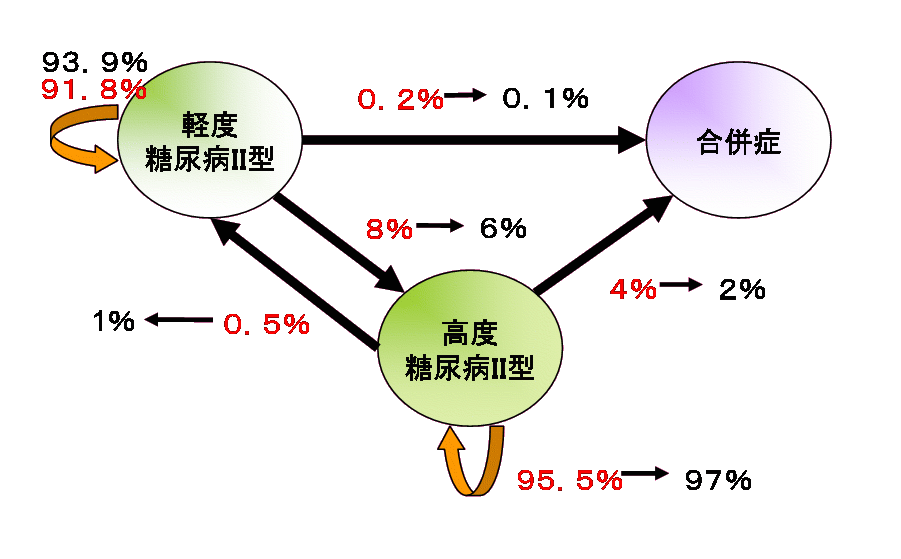
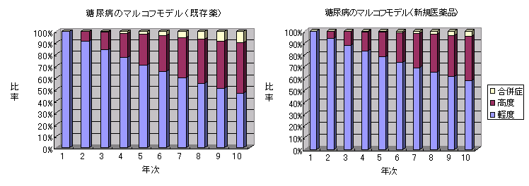

  日本の健康保険制度が崩壊の危機に瀕しています。このため、保険診療における患者負担は、被保険者本人においても、1割から2割に、そして3割にと増えてきました。慢性疾患の患者さんにとっては、時に多いな負担が強いられます。しかも、この状態が今後も続けば、3割負担でも、日本の健康保険制度が崩壊すると考えられています。原因は種々ありますが、老人医療費が諸外国と比べて多い〜平均寿命の高さを考慮しても〜のも、原因の1つと考えられています[1]。

  こうした中、経済的観点からも適正な医療が行われるよう、薬剤経済学と呼ばれる分野が発達してきました。すでに諸外国では、薬剤経済学的解析結果を薬価基準やある医薬品を保険診療の枠内に入れるかどうかなどの決定に用いる試みが行われています。もちろん、諸外国だけでなく、我が国でも、薬剤経済学解析が行われ始めています。例えば、田中ら[2]は、TS-1（tegafur、ftorafur、gimeracil、potassium oteracilateの混合物。最近コミックでも取り扱われたらしいのでご存じの方も多いでしょう）の進行再発胃ガンへの適用に関する経済学的分析を行い、QOLの面からも費用の面からもTS-1が既存治療法に比べ優れていると結論しています。

  上記のような経済学的分析には、計量的分析が不可欠です。中でも薬剤経済学の分野で比較的多く用いられるのが、決定木モデルと、マルコフモデルです。ここでは、マルコフモデルに関して少しみていきたいと思います。

  下図は、マルコフモデルの簡単な例です。ある年、初期のII型糖尿病の患者さん1000人を集めて観察を始めたとします。既存の治療薬では、次の年には、91.8%の方はそのままの状況で推移しますが、残念ながら、８％の方は重症化され、0.2％の方が、合併症を起こされると考えます（現実の数字ではありませんので念のため）。さらに次の年には、ごくわずかですが、0.5％の方が重症な糖尿病から少し回復されますが、高度な糖尿病患者さんのうち４％の方は、様々な合併症を引き起こされます。さて、新規治療薬を用いれば、これらの数字が少しづつ改善されて、それぞれ、６％、0.1％、１％、２％となるとします。それぞれの状態の患者さんの数の推移は、マルコフモデルより、下のグラフのように計算されますから、今仮に、軽度糖尿病の患者さんの治療に、年間100万円、高度糖尿病の患者さんに150万円、何らかの合併症を引き起こされた患者さんに1200万円必要だとします。と、簡単な計算により、10年間の総必要経費は、既存薬で154億円、新規治療薬で128億円だとわかります。新規治療薬ですと、26億円の節約になります。実際には、新規治療薬は概してコストが高いため、必ずしも効果の高い治療薬が節約になるとは限りません。また、中には死亡する患者さんもおられることや、より複雑な要因を加味する必要がありますが、いずれにしろ、このようなモデルを使うことにより、長期にわたって必要な経費を計算することができ、どの医薬品を用いることが経済的かを判断することができます。

マルコフモデル

## マルコフモデル
  もちろん、治療の手段を最終的に決定するのは患者さん本人です。しかし、経済学的な情報も含めてできうる限りの情報を患者さんに提供することにより、治療の手段を選択して頂くことが、今後、ますます求められています。経済学的モデルの計量科学的追求はまだ始まったばかりです。より多くの皆さんに計量薬学や薬剤経済学に興味を持って頂き、この世界の門をくぐっていただくことを期待しています。
## 参考文献
1. http://www2.health.ne.jp/library/3000/w3000684.html
2. 田中 克巳 ほか、「胃癌治療における化学療法の薬剤経済学的検討―経口フッ化ピリミジン製剤TS-1と 既存化学療法との医療費分析―」、癌と化学療法、30(1)、pp.73-80 (2003).
