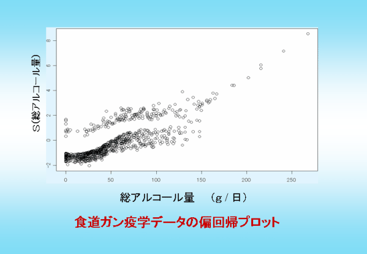

ある疾患（例えば食道ガン）を予防するためには、その疾患に何が関わっているのか、どんな要因（生活習慣、食事、環境など）が、その疾患に罹患する確率を上昇させるのかに関して、何らかの情報を得る必要があります。食道ガンでしたら、まず、職業、飲酒の程度、喫煙習慣、生活環境などが調査の対象になるでしょう。そして、たとえば特定の職業についているか否かといった○か×かの２値要因、毎日どの程度のアルコールを消費するかといった計量的データなどが集まってきます。このとき、疫学の分野での調査の方法に、２種類の方法があります。１つが前向き調査でもう一つが後ろ向き調査です。
## 前向き調査
前向き調査では、まず、健康な人の集団を要因別に２つに分けます。たとえば、全く飲酒の習慣がない人と一定量以上、毎日飲酒する習慣のある人に分けます。そして、この２つの集団を何年も追いかけて、食道ガンの発生率を比較します。両者で食道ガンの発生率に差がなければ、飲酒と食道ガンとは因果関係が大きくないと言うことになりますし、飲酒集団の方が食道ガンの発生率が高ければ、飲酒と食道ガンには一定の因果関係があるということになります。この例のような方法は、また、コホート分析とも呼ばれます。

## 後ろ向き調査
後ろ向き調査では逆に、すでに食道ガンに罹患された患者さんと健康な人との２つの集団に関して、過去の要因（職業、飲酒、喫煙習慣、生活習慣・環境）を調査します。食道ガンに罹患された患者さんの方が、毎日の飲酒量が多ければ、飲酒と食道ガンには一定の因果関係があるということになりますし、差がなければ、両者は無関係の可能性が高いと言うことになります。この例のような場合はまた、ケースコントロール研究とも呼ばれます。

こうした調査では、複数の要因が罹患率に影響を及ぼすことが考えられます。従って、単純に、飲酒習慣のあるなしだけで、2つに分けて調査しても意味がないことになります。複数の要因を同時に扱い、結果との因果関係を探る手法が必要になります。そこで、しばしば使われてきたのが、ロジスティック回帰という方法です。ロジスティック回帰モデルは、以下のようです。

式1

$$ \ln\left\{\frac{p(y)}{1-p(y)}\right\} = \beta_0 + \beta_1x_1 + \beta_2x_2 + \cdots + \beta_mx_m$$

$$p(y)$$ は $$y$$ と言う事象（例えば、食道ガンに罹患した）の確率を表しています。すると、分母の $$1-p(y)$$ は食道ガンに罹患しなかった確率になりますから、食道ガンに罹患したかしていないかの確率の比の対数は、いろんなリスクファクターと線形結合の関係にあるという前提がおかれていることになります。実際、この手法で、様々な疫学調査が行われています。例えば、農業技術研究機構[1]では、「ウンシュウミカン摂取頻度と疾患罹病に関するロジスティック回帰分析」が行われ、ウンシュウミカンの摂取が生活習慣病の予防に資する役割を論じていますし、太田ら[2]は、「基本健診データ結果等を活用した地域の健康リスク評価手法の開発と利用推進事業」を、ロジスティック回帰を中心にして行っています。

もちろん、これらの研究が有用でかつロジスティック回帰が今後共に疫学調査に重要な役割を担って行くであろうことは論を待たないのですが、世の中、必ずしもそう話が簡単な場合だけではありません。例えば、先の食道ガンとアルコール消費量との関係に関して言えば、アルコールの好きな方は、「どの位までなら大丈夫というような閾値はあるのか？」「逆にこれ以上は危険だという値はあるのか？」など、「線形でない部分」に関心があると思います。この問いに答えるには、ロジスティック回帰では不十分です。上式の左辺（ロジットと呼ぶ）と右辺の危険因子との間に、非線形な関係を許す手法でなければなりません。

最近では、「ノンパラメトリック手法」[3]と呼ばれる非線形手法が普及してきて、様々な分野で活躍を始めました。例えば、ノンパラメトリック手法の一つであるGAM[4]（一般化加法モデル）では、下式のような関係が表されます。

式2

$$\gamma(y) = \sum^p_{j=1} f_j(x_j) $$

$$y$$ が罹患したかしなかったかのような、２値データ（０か１か）の場合、$$\gamma(y)$$ は先のロジットが使われますから、GAMでは、ロジスティックモデルの線形部分（右辺）が、一変数関数、$$f_j(x_j)$$ の和で表されます。$$f_j(x_j)$$ は線形関数とは限りませんから、各変数とロジット、ひいては罹患率との間の非線形な関係を表すことが出来ます。$$f_j(x_j)$$ の決定には、散布図平滑化法という方法が用いられます。

GAMやloess,lowessなどのノンパラメトリック手法は、最近では、疫学の様々な場面で用いられるようになってきました。例えば、Ramsayら[5]は、大気汚染の時系列データに応用しています。ただし、彼らは、時系列データに応用した場合、誤差を小さく見積もりがちであるという点を注意しています。もはや、ノンパラメトリック回帰の疫学データへの応用は、「次の段階」に移りつつあります。

以下に、私たちが、GAMを食道ガンの危険因子の解明に応用した際のグラフを例示します[6]。私たちの研究室でも、GAMやノンパラメトリック回帰の持つ利点・欠点・改善方法等について、研究しつつあります（詳しくは研究内容のページをご覧ください）。総アルコール消費量が30g/日あたりから危険率の上昇が始まるなど、直線的にアルコール消費量と罹患率が関係しているわけではないことが示唆されています。もちろんこの研究結果は、更に詳細な調査を行わなければ、結論的なことは述べられませんが、ノンパラメトリック回帰の可能性を充分に見せつけてくれるものだと考えています。

今後、ますます非線形関係を記述する方法は重要化するものと思われます。皆さんもこの新しい研究分野に参加されませんか？

  
